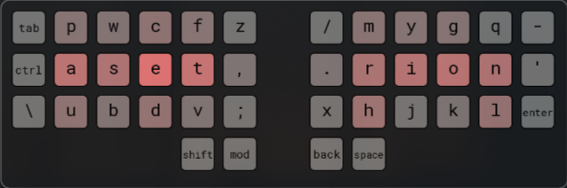

# Cadence

An ergonomic layout for columnar keyboards, designed for a natural typing rhythm and efficient Vim navigation.

---

## The Layout

## Philosophy & Goals

- **Vim Navigation:** Keeps `HJKL` grouped on the right-hand bottom row for seamless navigation.
- **Bottom-Row Comfort:** Designed for typists who find curling fingers to the bottom row more comfortable than stretching to the top row.
- **Home-Row Centric:** Over 80% of English typing is done on the home row, with `ASET` and `IRON` forming the core.
- **Pianist-Inspired Agility:** Leverages strong, independent pinkies by placing frequent letters like `n` in their natural path.
- **Ease of Transition:** Aims to be easy to adopt for QWERTY users by keeping many letters on the same fingers.

---

## A Pragmatic Approach

This layout does not aim to be the _most_ ergonomic layout, and it will likely be less efficient for general prose than giants like Dvorak or Colemak.

Instead, Cadence aims to be a significant improvement over QWERTY for those who live in a terminal and use Vim motions extensively, while drastically lowering the learning curve. As an example, while I average 90 WPM in QWERTY, it took me only 3 days to reach 30 WPM in Cadence, and two weeks to reach a comfortable 60 WPM.

---

## Performance Metrics

To objectively measure the efficiency of this layout, it was analyzed and compared against QWERTY and Colemak-DH using a standard English text corpus.

| Metric                  | QWERTY | Colemak-DH |  Cadence   |
| ----------------------- | :----: | :--------: | :--------: |
| **Home Row Usage**      | 27.8%  |   50.6%    | **50.0%**  |
| **Same-Finger Bigrams** | 6.575% |   1.669%   | **7.331%** |
| **Finger Effort**       | 2.446  |   1.726    | **1.960**  |

**A Note on Interpreting the Metrics:**

The data shows a massive improvement in home-row usage and overall finger effort compared to QWERTY. The score for **Same-Finger Bigrams** appears high as a result of an intentional design trade-off: to make the layout easier to learn for QWERTY users, some finger assignments were preserved, which also preserves some of QWERTY's inherent inefficiencies.

Furthermore, these analyzers use standard English prose for their calculations, and do not fully capture the unique typing patterns of programming or constant Vim navigation, which are the primary use cases for Cadence.

## Feedback & Contributing

Have you tried Cadence? I would love to hear about your experience. All feedback is welcomed, but I'm particularly interested in:

* Your typing background (QWERTY, Colemak, etc.).
* Any awkward or uncomfortable finger movements you've noticed.
* Your experience using it for programming languages vs. regular prose.

The best way to provide feedback is by **opening an issue** on GitHub.
